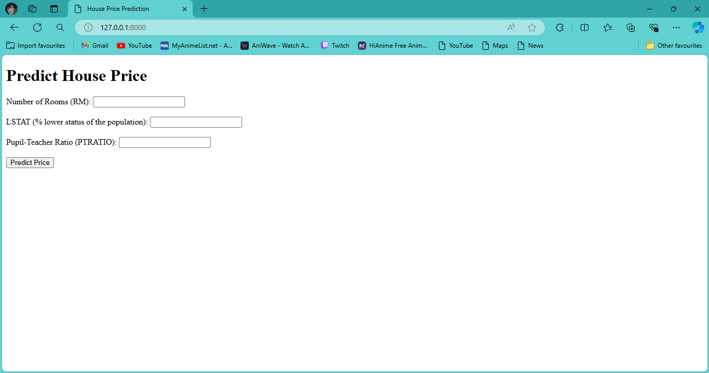

# House Price Predictor


## Overview

House Price Predictor is a Django-based web application that uses machine learning to predict house prices based on various features. The application leverages a linear regression model trained on historical housing data to provide price predictions.

## Features

- User-friendly web interface for inputting house features
- Real-time price prediction based on user inputs
- Historical data visualization
- Model performance metrics display
- Easy deployment with Docker

## Installation

### Prerequisites

- Python 3.x
- Django
- Docker (optional, for containerized deployment)

### Steps

1. Clone the repository:
    ```bash
    git clone https://github.com/yourusername/house-price-predictor.git
    cd house-price-predictor
    ```

2. Create a virtual environment and activate it:
    ```bash
    python3 -m venv venv
    source venv/bin/activate  # On Windows use `venv\Scripts\activate`
    ```

3. Install the required packages:
    ```bash
    pip install -r requirements.txt
    ```

4. Run the Django migrations:
    ```bash
    python manage.py migrate
    ```

5. Start the Django development server:
    ```bash
    python manage.py runserver
    ```

6. Open your web browser and navigate to `http://127.0.0.1:8000/` to use the application.

## Usage

1. Enter the required house features into the input fields on the web interface.
2. Click the "Predict" button to get the estimated house price.
3. View the historical data and model performance metrics.

## Model Training

To train the linear regression model on your own dataset:

1. Place your dataset in the `data/` directory.
2. Modify the `train_model.py` script to load your dataset.
3. Run the training script:
    ```bash
    python train_model.py
    ```
4. The trained model will be saved in the `models/` directory.

## Docker Deployment

To deploy the application using Docker:

1. Build the Docker image:
    ```bash
    docker build -t house-price-predictor .
    ```

2. Run the Docker container:
    ```bash
    docker run -p 8000:8000 house-price-predictor
    ```

3. Open your web browser and navigate to `http://127.0.0.1:8000/` to use the application.

## Contributing

Contributions are welcome! Please fork the repository and submit a pull request.

## License

This project is licensed under the MIT License. See the `LICENSE` file for more details.
